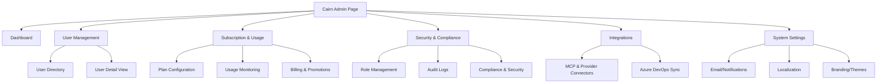
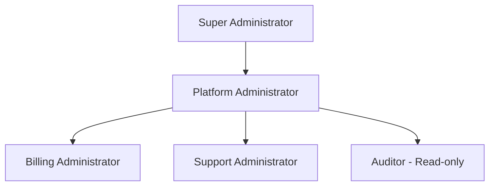
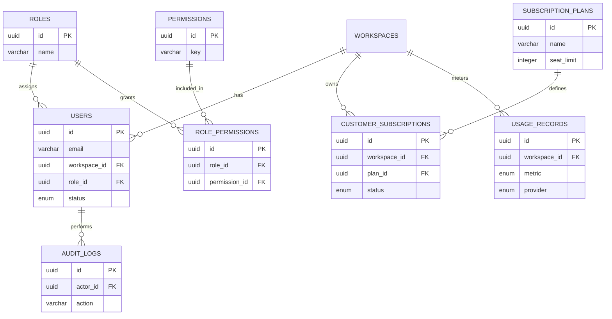
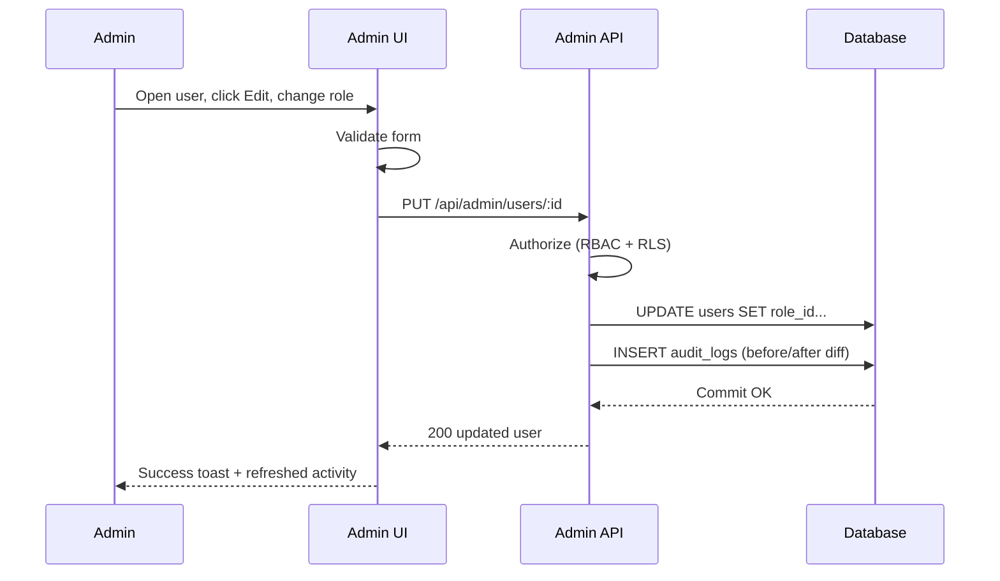

# Cairn Admin Page Specifications

## Overview

The Cairn Admin Page is the central control hub for operating the Cairn platform — the AI-native project management system whose differentiator is an enforced Portfolio → Project → Story → Task hierarchy plus provider-agnostic AI attribution across Copilot, ChatGPT, Gemini, and Claude. From a single, legible workspace, platform staff manage customer accounts and workspaces, configure and monitor the Free / Pro / Enterprise subscription tiers, govern security and compliance, and administer system-wide integrations (MCP connectors, Azure DevOps sync) and settings. True to Cairn's brand promise of *calm, legible control*, the Admin Page turns what is normally scattered across billing tools, support inboxes, and database consoles into one trustworthy source of truth — so administrators spend their time on decisions, not on reconciling state by hand.

## User Personas

### Primary User: Platform Administrator

- **Role:** Operates the Cairn SaaS platform end to end — owns customer accounts, workspaces, subscription tiers, integrations, and global system configuration.
- **Goals:**
  - Manage users, organizations, and workspaces (provision, edit, suspend, offboard).
  - Configure subscription plans (Free / Pro / Enterprise), monitor seat/project/AI-capture usage, and oversee billing health.
  - Govern security: roles, audit trails, SSO/SAML, data-retention and compliance settings.
  - Administer platform-wide integrations and notifications.
- **Pain points:**
  - The exact pain Cairn solves for its own users — context scattered across Stripe, the auth provider, logs, and spreadsheets, with no single honest answer to "what is the state of this account right now?"
  - Destructive actions (suspend, delete, downgrade) with no clear audit trail or undo.
  - No real-time visibility into AI-provider usage and cost per workspace.

### Secondary User: Support Administrator

- **Role:** Front-line customer support; assists users without full platform control.
- **Goals:**
  - Look up a user/workspace quickly and see account status, plan, and recent activity.
  - Resolve common issues — resend magic-link sign-in, unlock accounts, restart a failed AI capture, adjust a seat count within policy.
  - Escalate billing or security changes to a Platform Administrator.
- **Pain points:**
  - Over-broad access creating risk, or under-scoped access forcing escalation for trivial tasks.
  - No quick, read-mostly view of a customer's recent audit/activity timeline.
  - Inability to act safely (e.g., impersonate read-only) without exposing sensitive billing data.

## Features and Functionality

### 1. User Management

- **User Directory:** Paginated, searchable, filterable data table of all users (filters: workspace, plan, role, status, AI-provider activity, signup date). Columns: name, email, workspace, plan, role, status, last active. Bulk actions (suspend, export, assign role) with confirmation.
- **User Detail View:** Single-user profile showing identity, owning workspace(s), subscription/seat, assigned admin role, provider-attribution activity (which AI tools they use), and a recent audit/activity timeline. Tabs: Overview, Subscription, Activity, Security.
- **Creation / Editing:** Create a user and assign workspace, role, and seat; edit profile fields and role. Email is validated; magic-link invite is sent on creation (Cairn uses passwordless auth).
- **Suspension / Deletion:** Suspend (reversible) or schedule deletion (soft-delete with retention window per compliance settings). All actions require a confirmation dialog stating consequences and are written to the audit log. Hard deletion is restricted to Super Administrator.

### 2. Subscription and Usage Management

*(Cairn is a freemium-to-enterprise SaaS: Free, Pro at $25/user/mo, and custom Enterprise; usage is metered by seats, projects, AI captures, and per-provider token spend.)*

- **Plan Configuration:** Create/edit plans and their entitlements — seat limits, project/portfolio limits, AI-capture quotas, attribution-provider count, feature flags (drift detection, ADO/MCP sync, custom dashboards, SSO). Toggle monthly/annual pricing and annual discount.
- **Usage Monitoring:** Real-time dashboards per workspace and platform-wide: active seats vs. limit, projects in flight, AI captures consumed, and **per-provider token/cost** (Claude, ChatGPT, Copilot, Gemini) — the cross-provider work-item ledger surfaced at the account level. Threshold alerts for overage and aging trials.
- **Billing Integration:** Stripe integration for invoices, payment status, proration, and dunning. View subscription lifecycle (trial → active → past_due → canceled), issue refunds/credits, and resync billing state.
- **Promotional Tools:** Create coupons/trials (e.g., "Pro free for 30 days"), nonprofit/education discounts, and grandfathered pricing. Each promo records eligibility rules and an expiry.

### 3. Security and Compliance

- **Role Management:** Create and assign admin roles; manage the RBAC model (see *Security Roles and Permissions*). View effective permissions per admin.
- **Audit Logging:** Immutable, queryable log of every administrative action (actor, action, resource, before/after diff, IP, timestamp). Filter, search, and export for review.
- **Compliance Settings:** Data-retention windows, soft-delete/purge policies, GDPR data-export and right-to-erasure tooling, and a consent/region configuration. *(Compliance certifications are on Cairn's roadmap; settings are built to support them.)*
- **Security Settings:** SSO/SAML and SCIM for Enterprise, session/timeout policy, IP allowlists, enforced step-up confirmation for destructive actions, and provider API-key/secret management for MCP connectors.

### 4. System Configuration

- **Integration Management:** Configure MCP connectors and provider integrations (Claude, ChatGPT/OpenAI, Gemini, GitHub Copilot), Azure DevOps pipeline sync, and tools such as GitHub, Slack, Linear, Jira, and Notion. Manage credentials, scopes, health status, and enable/disable per plan.
- **Email / Notification Settings:** Templates and triggers for transactional email (magic-link, invites, trial-ending, overage), notification channels, and per-event toggles.
- **Localization Settings:** Default locale, supported languages, time zone, currency, and date/number formats.
- **Branding Settings:** Platform theme controls built on the Cairn design system (DaisyUI themes), light/dark defaults, logo, and Enterprise white-label/custom-domain options.

## User Interface Design

### Layout

A responsive, mobile-first layout with four regions:

- **Left Sidebar (collapsible):** Primary admin navigation grouped by domain (Dashboard, Users, Subscriptions, Security, Integrations, Settings). Collapses to icons on tablet; becomes a slide-out drawer on mobile.
- **Header:** Global search (users/workspaces), environment indicator, notifications, theme toggle, and the admin's profile/role menu.
- **Main Content Area:** Page-specific content — data tables, detail views, cards, and forms — within a centered container with generous whitespace.
- **Footer:** Build/version, environment, links to status, docs, and the "concept project — ISM6427c" disclaimer.

### Key UI Components

- **Header:** Global search combobox, notification popover, theme toggle, admin avatar menu, breadcrumb trail.
- **Navigation:** Collapsible sidebar with grouped nav items, active-state indicator, and role-gated visibility (items hidden if the admin lacks permission).
- **Content:**
  - **Data Tables** — sortable/filterable/paginated directories (users, subscriptions, audit logs) with row actions and bulk selection.
  - **Cards** — KPI/stat tiles (active seats, MRR, AI spend by provider) and grouped settings panels.
  - **Modals / Drawers** — create/edit forms, and **confirmation dialogs** for destructive actions.
  - **Provider Attribution Badges** — reused from the product to show per-provider usage/cost (Claude / ChatGPT / Copilot / Gemini fixed hues).
  - **Tabs, Toasts, Skeletons, Empty States, Charts** — for detail views, feedback, loading, and usage trends.

### Visual Design

The Admin Page **must follow the Cairn [Brand Identity & Design System](./brand-design-system.md)** exactly:

- **Color:** Stone-neutral surfaces with the single **signal teal** accent (`#14b8a6`) for primary actions and highlights; **ink** (`#0b1220`) for dark mode; the fixed **attribution palette** (Claude `#f97316`, ChatGPT `#10b981`, Copilot `#8b5cf6`, Gemini `#0ea5e9`) for provider data only; **functional** colors (success `#16a34a`, warning `#f59e0b`, error `#dc2626`) for status. Never use provider color as the only signal.
- **Typography:** **Sora** for headings, **Inter** for body/UI, on the documented type scale (`h1`…`h6`, body, caption).
- **Micro-interactions:** Button hover/active, form focus rings (`signal-400`), loading skeletons, success pulses, and subtle fade-up reveals — all honoring `prefers-reduced-motion`.
- **Dark/Light Mode:** Class-based dark mode with system detection and a persisted toggle (DaisyUI themes as the extension mechanism).

## Database Schema

*(PostgreSQL, consistent with Cairn's Supabase backend. Types: `UUID`, `VARCHAR`, `TEXT`, `BOOLEAN`, `INTEGER`, `NUMERIC`, `TIMESTAMP`, `JSONB`, `ENUM`. PK = primary key, FK = foreign key.)*

### Users Table

| Column | Type | Keys / Notes |
|---|---|---|
| `id` | UUID | PK, default `gen_random_uuid()` |
| `email` | VARCHAR(255) | UNIQUE, NOT NULL |
| `full_name` | VARCHAR(255) | |
| `workspace_id` | UUID | FK → workspaces.id |
| `role_id` | UUID | FK → roles.id |
| `status` | ENUM('active','suspended','pending','deleted') | NOT NULL, default 'pending' |
| `auth_provider` | VARCHAR(50) | e.g. 'magic_link' |
| `preferences` | JSONB | UI/theme/notification prefs |
| `last_active_at` | TIMESTAMP | |
| `created_at` | TIMESTAMP | NOT NULL, default `now()` |
| `updated_at` | TIMESTAMP | NOT NULL, default `now()` |
| `deleted_at` | TIMESTAMP | NULL = active (soft delete) |

### Roles Table

| Column | Type | Keys / Notes |
|---|---|---|
| `id` | UUID | PK |
| `name` | VARCHAR(100) | UNIQUE, NOT NULL (e.g. 'super_admin') |
| `display_name` | VARCHAR(100) | NOT NULL |
| `description` | TEXT | |
| `is_system` | BOOLEAN | default false (system roles non-deletable) |
| `created_at` | TIMESTAMP | default `now()` |

### Permissions Table

| Column | Type | Keys / Notes |
|---|---|---|
| `id` | UUID | PK |
| `key` | VARCHAR(100) | UNIQUE, NOT NULL (format `action:resource`) |
| `category` | VARCHAR(50) | NOT NULL (e.g. 'user_management') |
| `description` | TEXT | |

### Role Permissions Table

| Column | Type | Keys / Notes |
|---|---|---|
| `id` | UUID | PK |
| `role_id` | UUID | FK → roles.id, NOT NULL |
| `permission_id` | UUID | FK → permissions.id, NOT NULL |
| | | UNIQUE(`role_id`,`permission_id`) |

### Subscription Plans Table

| Column | Type | Keys / Notes |
|---|---|---|
| `id` | UUID | PK |
| `name` | VARCHAR(100) | NOT NULL ('Free','Pro','Enterprise') |
| `slug` | VARCHAR(100) | UNIQUE |
| `price_monthly` | NUMERIC(10,2) | NULL for custom |
| `price_annual` | NUMERIC(10,2) | NULL for custom |
| `seat_limit` | INTEGER | NULL = unlimited |
| `project_limit` | INTEGER | NULL = unlimited |
| `capture_quota` | INTEGER | monthly AI captures |
| `provider_limit` | INTEGER | attribution providers allowed |
| `features` | JSONB | feature flags |
| `is_active` | BOOLEAN | default true |
| `created_at` | TIMESTAMP | default `now()` |

### Customer Subscriptions Table

| Column | Type | Keys / Notes |
|---|---|---|
| `id` | UUID | PK |
| `workspace_id` | UUID | FK → workspaces.id, NOT NULL |
| `plan_id` | UUID | FK → subscription_plans.id, NOT NULL |
| `status` | ENUM('trialing','active','past_due','canceled') | NOT NULL |
| `billing_cycle` | ENUM('monthly','annual') | NOT NULL |
| `seats` | INTEGER | NOT NULL |
| `stripe_customer_id` | VARCHAR(255) | |
| `stripe_subscription_id` | VARCHAR(255) | |
| `trial_ends_at` | TIMESTAMP | |
| `current_period_end` | TIMESTAMP | |
| `created_at` | TIMESTAMP | default `now()` |
| `updated_at` | TIMESTAMP | default `now()` |

### Usage Records Table

| Column | Type | Keys / Notes |
|---|---|---|
| `id` | UUID | PK |
| `workspace_id` | UUID | FK → workspaces.id, NOT NULL |
| `metric` | ENUM('seats','projects','captures','tokens') | NOT NULL |
| `provider` | ENUM('human','claude','chatgpt','copilot','gemini') | NULL except token/capture metrics |
| `quantity` | NUMERIC(14,2) | NOT NULL |
| `cost` | NUMERIC(12,4) | computed provider cost |
| `period_start` | TIMESTAMP | NOT NULL |
| `period_end` | TIMESTAMP | NOT NULL |
| `recorded_at` | TIMESTAMP | default `now()` |

### Audit Logs Table

| Column | Type | Keys / Notes |
|---|---|---|
| `id` | UUID | PK |
| `actor_id` | UUID | FK → users.id (admin who acted) |
| `action` | VARCHAR(100) | NOT NULL (e.g. 'update:user') |
| `resource_type` | VARCHAR(100) | NOT NULL |
| `resource_id` | UUID | |
| `changes` | JSONB | before/after diff |
| `ip_address` | VARCHAR(45) | |
| `user_agent` | TEXT | |
| `created_at` | TIMESTAMP | NOT NULL, default `now()` (append-only) |

## Security Roles and Permissions

### Role Hierarchy

1. **Super Administrator** — Unrestricted access, including role/permission management, hard deletion, and security configuration. Non-deletable system role.
2. **Platform Administrator** — Full user, subscription, integration, and settings management; cannot alter the role model or perform hard deletes.
3. **Billing Administrator** — Manage subscription plans, billing, promotions, and usage; read-only elsewhere.
4. **Support Administrator** — Read-mostly user lookup; resend magic links, unlock accounts, restart captures, adjust seats within policy; no billing or security changes.
5. **Auditor (Read-only)** — View-only access to users, subscriptions, and audit logs for compliance review; no mutations.

### Permission Categories

- **User Management:** `view:users`, `create:users`, `update:users`, `suspend:users`, `delete:users`, `impersonate:users`
- **Subscription Management:** `view:subscriptions`, `manage:plans`, `update:subscriptions`, `view:billing`, `manage:billing`, `manage:promotions`
- **Usage & Analytics:** `view:usage`, `export:usage`
- **Security & Compliance:** `view:roles`, `manage:roles`, `view:audit_logs`, `export:audit_logs`, `manage:compliance`, `manage:security`
- **System Configuration:** `view:integrations`, `manage:integrations`, `manage:notifications`, `manage:localization`, `manage:branding`

## API Endpoints

*(RESTful, JSON. All endpoints require an authenticated admin session and are authorized against the RBAC permissions above. Standard responses: 200/201, 204, 400, 401, 403, 404, 409, 422, 429, 500.)*

### User Management Endpoints

- `GET /api/admin/users` — list/search/filter (pagination)
- `POST /api/admin/users` — create user + send magic-link invite
- `GET /api/admin/users/:id` — user detail
- `PUT /api/admin/users/:id` — update profile/role/seat
- `POST /api/admin/users/:id/suspend` — suspend (reversible)
- `POST /api/admin/users/:id/resend-invite` — resend magic link (Support)
- `DELETE /api/admin/users/:id` — soft delete (hard delete: Super Admin only)

### Role Management Endpoints

- `GET /api/admin/roles` — list roles
- `POST /api/admin/roles` — create role
- `GET /api/admin/roles/:id` — role + permissions
- `PUT /api/admin/roles/:id` — update role / assign permissions
- `DELETE /api/admin/roles/:id` — delete (non-system roles)
- `GET /api/admin/permissions` — list permission catalog

### Subscription Management Endpoints

- `GET /api/admin/plans` — list plans
- `POST /api/admin/plans` — create plan
- `PUT /api/admin/plans/:id` — update plan/entitlements
- `GET /api/admin/subscriptions` — list customer subscriptions
- `PUT /api/admin/subscriptions/:id` — change plan/seats/status
- `GET /api/admin/usage` — usage + per-provider cost (filters)
- `POST /api/admin/promotions` — create coupon/trial/discount

### System Configuration Endpoints

- `GET /api/admin/integrations` — list connectors + health
- `POST /api/admin/integrations` — add/configure connector
- `PUT /api/admin/integrations/:id` — update/enable/disable
- `GET /api/admin/settings` — fetch settings (email, localization, branding)
- `PUT /api/admin/settings` — update settings

### Audit and Security Endpoints

- `GET /api/admin/audit-logs` — query/filter audit log
- `GET /api/admin/audit-logs/export` — export (CSV/JSON)
- `GET /api/admin/security` — security/compliance config
- `PUT /api/admin/security` — update SSO/SAML, retention, policies

## User Flows

### User Management Flow

1. Admin opens **Users**, searches the directory, and selects a user.
2. The Detail View loads (Overview, Subscription, Activity, Security).
3. Admin clicks **Edit**, changes the role/seat in a drawer form (real-time validation).
4. On **Save**, the API authorizes the action, persists changes, and writes an audit-log entry with a before/after diff.
5. A success toast confirms; the Activity tab shows the new event.

### Subscription Management Flow

1. Billing Admin opens **Subscriptions** and selects a workspace.
2. Reviews usage cards (seats, projects, captures, per-provider cost) and current plan/status.
3. Clicks **Change Plan** → selects plan + billing cycle + seats; the UI previews proration.
4. **Confirm** triggers the API → Stripe update → subscription record update → audit entry.
5. Status and `current_period_end` refresh; an overage alert clears if resolved.

### Role and Permission Management Flow

1. Super Administrator opens **Security → Roles**.
2. Creates or selects a role and opens the permission matrix (grouped by category).
3. Toggles granular `action:resource` permissions; the UI shows effective access.
4. **Save** persists role-permission rows and logs the change.
5. Affected admins' sessions re-evaluate permissions on next request (nav and actions re-gate immediately).

## Error Handling

- **Form Validation:** Inline, real-time validation with clear messages (e.g., invalid email, seat count exceeding plan limit); submit disabled until valid.
- **Confirmation Dialogs:** Required for destructive/irreversible actions (suspend, delete, downgrade, role changes), stating consequences; hard deletes require typed confirmation.
- **Authorization Errors:** 403 surfaces a friendly "you don't have permission" state; gated nav/actions are hidden rather than shown-then-denied.
- **Optimistic UI + Rollback:** Optimistic updates revert on API error with a toast and retry option.
- **Activity Logging:** Every mutation (success or failure) is recorded; billing/Stripe failures show actionable dunning context.
- **Rate Limiting & Idempotency:** 429 handling with backoff; idempotency keys on billing mutations to prevent double-charges.

## Accessibility Considerations

- **WCAG 2.1 AA** color contrast (≥4.5:1 body, ≥3:1 large/UI); provider color never the sole signal (paired with labels).
- **Keyboard Navigation:** All tables, drawers, modals, and the command/search fully operable by keyboard with logical focus order and focus trapping in dialogs.
- **Screen Reader Support:** Semantic HTML + ARIA roles/labels on tables, tabs, dialogs, and status badges; live regions for toasts and async results.
- **Visible Focus Indicators:** Consistent `signal-400` focus-visible ring across all interactive elements.
- **Reduced Motion:** All non-essential animation gated behind `prefers-reduced-motion`.

## Implementation Notes

- **RBAC enforcement:** Authorize on the server for every request (defense in depth) and enforce at the data layer with **Supabase Row-Level Security**; the UI gates nav/actions purely for UX, never as the security boundary.
- **Append-only audit log:** Write audit entries in the same transaction as the mutation; make the table insert-only (no update/delete) and back exports with pagination.
- **Server-side rendering / data fetching:** Render admin pages server-side (or with server components/loaders) for fast first paint and to keep authorization off the client.
- **Real-time updates:** Use **Supabase Realtime / WebSockets** for live usage dashboards, status changes, and audit feeds so multiple admins see consistent state.
- **Billing:** Integrate Stripe via webhooks (subscription lifecycle, invoice events) with idempotency; reconcile `customer_subscriptions` from webhook truth.
- **Secrets:** Store provider/MCP credentials encrypted at rest; never expose secret keys to the browser; the publishable/anon key only client-side.
- **Soft delete + retention:** Default to soft delete with a configurable retention window; a scheduled job purges per compliance settings.

## Mermaid Diagrams

### Admin Page Structure

### User Role Hierarchy

### Database Relationship Diagram

### User Management Flow

